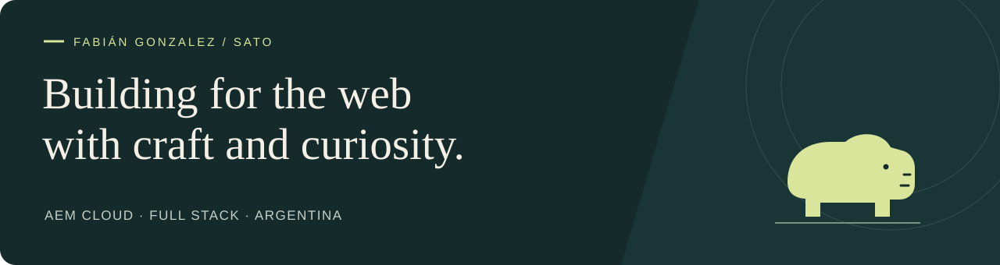

<a href="README.md" lang="es">Español</a> · <strong>English</strong>

# Hi, I'm Fabián. You can call me Sato. 👋

**Senior AEM Full-Stack Developer · AEM Tech Lead · Argentina**

I like understanding how things work and turning that curiosity into web experiences that feel simple. For over **10 years**, I've been connecting code, content and people, from online stores to digital platforms for global brands.

[Portfolio & blog ↗](https://fabiansato.github.io/en/) · [LinkedIn ↗](https://www.linkedin.com/in/fabiangonzalezdev) · [Say hello ↗](mailto:fabiangonzalezdev@gmail.com)

---

## A short letter of introduction

Thanks for stopping by. I'm a software developer specializing in **Adobe Experience Manager Cloud**, with one foot in Java and the other in frontend engineering. I enjoy designing reusable components just as much as refining the details that make a page faster, more accessible and pleasant to use.

My work has taken me across international teams, digital products for different brands and opportunities to mentor other developers. Along the way, I've come to value code that makes sense, documentation that helps and conversations that move a problem forward.

This space brings together part of that journey: public projects, tools born from practical needs and notes to keep learning. If something here is useful to you, sharing it was already worthwhile.

**— Fabián / Sato**

## What I bring to a project

| Area | My work |
| :--- | :--- |
| **AEM & content architecture** | AEM Cloud, AEM Sites, HTL, Sling Models, OSGi and Java. Reusable components and authoring experiences. |
| **Frontend** | React, TypeScript, JavaScript, HTML, CSS and Sass. Responsive interfaces, accessibility and performance. |
| **Integrations & delivery** | Node.js, REST APIs, Git and CI/CD. Connecting systems and taking care of the path to production. |
| **Technical leadership** | Architecture decisions, mentoring, documentation and collaboration with distributed teams in Spanish and English. |

## A few stops along the way

- **Danone France / Activia** — technical leadership and AEM Cloud implementation within a global ecosystem, including components, content and integrations for different markets.
- **Whirlpool USA** — component development with HTL, Sling Models and React, plus AEM integrations with Workfront Fusion and external APIs.
- **DEPT® / Keysight USA** — AEM software engineering, CI/CD pipelines and technical mentoring.
- **Unilever LATAM / OLIVER** — multilingual websites, reusable templates and brand experiences for Sedal, TRESemmé, Hellmann’s, Knorr and Savora.

You can explore my full experience and selected work in my [portfolio](https://fabiansato.github.io/en/).

## Projects to open and explore

A selection of public repositories: tools, applications and experiments that show different sides of my work.

| Project | What you'll find | Technologies |
| :--- | :--- | :--- |
| [**MIMO-FE ↗**](https://github.com/fabiansato/Mimo-FE) | A local game library with a console-inspired interface and a desktop application in beta. [Project website](https://github.com/fabiansato/Mimo-FE-web). | React · TypeScript · Tauri · Rust |
| [**Kit Maestro / Tiendanube ↗**](https://github.com/fabiansato/kitmaestro-tiendanube) | A store theme and catalog tools for video games, technology and collectibles. | Tiendanube · JavaScript · Node.js |
| [**Lighthouse Reporting Tool ↗**](https://github.com/fabiansato/lighthouse-reporting-tool) | Audits for multiple URLs, with performance, accessibility, best practices and SEO metrics exported to CSV. | JavaScript · Lighthouse · PageSpeed |
| [**PageSpeed Insights Reporter ↗**](https://github.com/fabiansato/pagespeed-insights-reporter) | Mobile and desktop performance reports, with improvement suggestions for a list of URLs. | Node.js · PageSpeed API · CSV |
| [**CartaTienda Commerce ↗**](https://github.com/fabiansato/cartatienda-commerce) | A commerce application with a product catalog, shopping cart, WhatsApp order composition and an administration panel. | React · TypeScript |
| [**Dynamic Search Card / AEM ↗**](https://github.com/fabiansato/weretail-dynamicsearchcard-core) | An AEM backend example: a Sling servlet that exposes external API data through an OSGi service. | Java · Sling · OSGi |
| [**Ollama TXT Processor ↗**](https://github.com/fabiansato/real_time_transcriber) | A terminal experiment for sending text files to local Ollama models and receiving their responses. | Python · Ollama |

[Explore all my repositories ↗](https://github.com/fabiansato?tab=repositories)

## Learning, writing & sharing

My [blog and portfolio](https://fabiansato.github.io/en/) is where I bring together my work and notes. GitHub also holds the resources I've built while learning:

**Quick references:** [JavaScript](https://github.com/fabiansato/javascript-cheatsheet) · [Python](https://github.com/fabiansato/python-cheatsheet) · [Java](https://github.com/fabiansato/java-cheatsheet) · [Git](https://github.com/fabiansato/GIT-Cheatsheet) · [Linux terminal](https://github.com/fabiansato/linux-terminal-cheatsheet)

**Hands-on practice:** [JavaScript](https://github.com/fabiansato/javascript-ejercicios) · [Python](https://github.com/fabiansato/Python-Ejercicios) · [React](https://github.com/fabiansato/30-dias-react)

The original learning corner

I've kept the [original introduction and learning resources](docs/archive/readme-legacy.md), in Spanish. It's part of this profile's history; some links and content in that archive may be outdated.

## Let's keep the conversation going

If you'd like to talk about AEM, web development or an idea you're excited about, [send me a note](mailto:fabiangonzalezdev@gmail.com). I enjoy meeting the people behind the projects.

[**Portfolio**](https://fabiansato.github.io/en/) · [**LinkedIn**](https://www.linkedin.com/in/fabiangonzalezdev) · [**Email**](mailto:fabiangonzalezdev@gmail.com)

And yes, the capybara is still here. Curiosity and a little calm are useful tools too. ☺
